# Lab 6: Reinforcement Learning

[Pessiglione et al. (2006)](https://www.ncbi.nlm.nih.gov/pmc/articles/PMC2636869/pdf/ukmss-3672.pdf) use a model of reinforcement learning to predict when people will experience a *reward prediction error* in a simple two-choice task. They use the model to find regions of the brain with activity patterns that correlate with the expected experienced reward prediction error.

## The experimental task

On each trial, subjects viewed two abstract visual stimuli and selected one of them. One of the shapes was associated with a high probability (0.8) of a positive reward (1£) and the other was associated with a low probability (0.2) of the positive reward. If the reward was not received, the subject got no money for that trial.

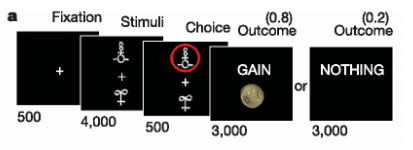

Each subject in the experiment completed 30 trials. (*Note: there were also two other conditions, one with negative rewards and one with no rewards, but we don't need to model those for the purpose of this exercise*).

## The model

The reinforcement learning model describes the expected reward, 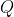, for selecting a particular stimulus. 

The model begins with the expected value of each stimulus (called A and B) at 0. 

The model chooses a stimulus using the *softmax* rule. This rule says that if you have a set of choices and each choice has some expected value, you choose probabilistically, assigning a higher probability to items with more value. This means that you don't always choose the option with the highest value. The *softmax* rule has a parameter called the *temperature*, denoted as 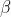. When this parameter is very **low** then the options the highest value are strongly preferred. When the parameter is **high** then there is more randomness in the decision making.  The equation that formalizes this approach is:

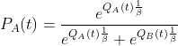

This formula describes the probability of selecting stimulus A at time 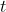, 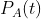, based on the current expected value of choosing A, 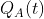, and choosing B, 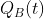. In R, 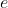 raised to a power can be achieved with the `exp()` function.

Once the model makes a choice, it receives a reward 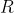. In our example this reward can be either 0 or 1.

The model then updates the expected value of the choice. Say the model chose A at time step . The new expected value of A at time step 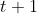 would become:

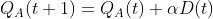

where

Let's break down the formulas here. 

The first formula says that the new expected value of A, 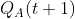, is equal to the old expected value of A, , plus 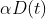. So the first thing to notice is that this model is changing the expected value based on new information, not assigning a new expected value after every trial.

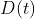 describes the *difference* between the actual reward and the model's expected reward. This is shown in the second equation. The actual reward at time  is 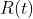 and the model's expected reward at time  is . 

The final puzzle piece is , which is the learning rate parameter. If  is very large, then the model will update its expectations very quickly. If  is small, then the model will only update the expected reward a little bit after each trial.

Note that the expected value of the stimulus that was not selected is not updated.

## Your task

1. Start with `mini-tutorial.R`. This will teach you one new trick that is useful for completing the lab.
2. Implement the reinforcement learning model in `model.R`, and answer a few questions.

